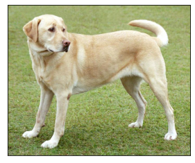
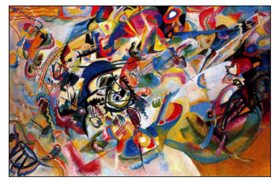
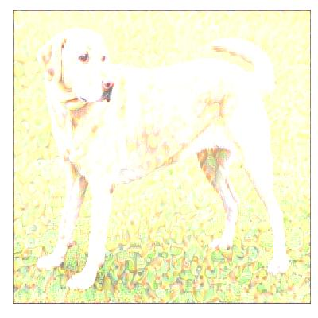

# Neural Style Transfer using TensorFlow

This project implements Neural Style Transfer using TensorFlow and the VGG19 model.

It combines the content of one image with the artistic style of another image to create a new stylized image.

## Technologies Used

- Python
- TensorFlow
- NumPy
- Matplotlib

## What This Project Does

Loads a content image and a style image
Uses the VGG19 model for feature extraction
Computes content and style loss
Generates a stylized image using gradient optimization
Saves the final output image

## Input Images

Place these images in your project folder:

## Features
Neural Style Transfer
VGG19 feature extraction
Content and style loss optimization
Intermediate image generation
Final image saving
Output

## Final generated image is saved as:

